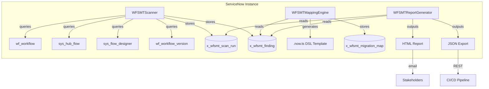
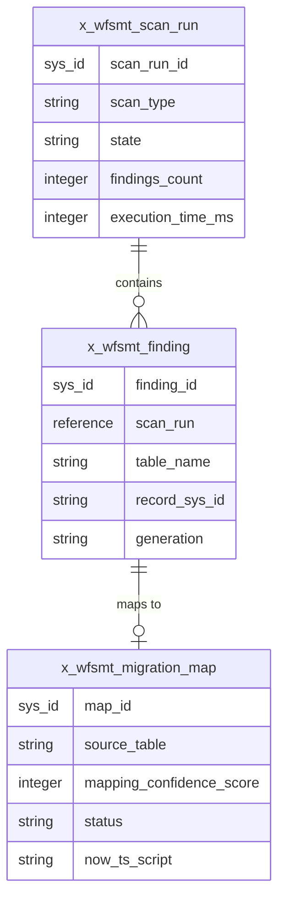

# Workflow Studio Migration Tracker (WFSMT)

**Scope Prefix:** `x_wfsmt`
**Repository:** `vladarchitectservicenow-oss/ServiceNow-WFSMT`
**License:** AGPL-3.0-only
**Version:** 1.0.0
**Author:** Vladimir Kapustin — ServiceNow Solution Architect

[](https://www.gnu.org/licenses/agpl-3.0)
[](https://github.com/vladarchitectservicenow-oss/ServiceNow-WFSMT/releases)
[](https://github.com/vladarchitectservicenow-oss/ServiceNow-WFSMT/actions)

---

## Overview

Workflow Studio Migration Tracker (WFSMT) is a ServiceNow scoped application that discovers, classifies, and maps workflow artifacts across three generations of ServiceNow automation: **Legacy Workflows** (`wf_workflow`, `wf_workflow_version`), **Flow Designer Flows** (`sys_hub_flow`), and **Workflow Studio** (`.now.ts` DSL). It calculates migration velocity, assigns confidence scores to activity mappings, auto-generates `.now.ts` DSL templates, and produces executive-ready HTML and JSON reports — all from within the instance boundary.

The ServiceNow platform's workflow engine has evolved across three distinct eras. Legacy Workflows built on `wf_workflow` tables are being deprecated. Flow Designer (`sys_hub_flow`) was introduced as a low-code alternative. Now Workflow Studio brings a TypeScript-native DSL (`.now.ts`) that integrates with modern CI/CD pipelines and source control. Organizations managing hundreds or thousands of workflows across these generations face a critical question: **what do we have, where is it, and how do we migrate it?**

WFSMT answers this question by scanning all four workflow tables, classifying each artifact by generation, mapping activities to their `.now.ts` equivalents, and calculating a migration velocity percentage that gives leadership a single metric to track progress. Unlike external migration consultants or manual spreadsheet audits, WFSMT operates natively within the ServiceNow security model — data never leaves the instance.

## Why WFSMT

If your organization runs ServiceNow workflows spanning multiple generations, you need a single-source-of-truth inventory. WFSMT provides automated discovery, classification, and mapping in minutes — replacing weeks of manual auditing. Built as a native scoped app, it requires no external infrastructure, no credential export, and no data egress. Install, scan, map, report — all inside your instance.

## Problem Statement

Enterprise ServiceNow customers upgrading from Zurich to Australia face a fragmented workflow landscape. Legacy workflows built years ago coexist with Flow Designer flows built last quarter and Workflow Studio artifacts built this week. Without systematic discovery and classification:

- **No inventory exists.** Teams don't know how many legacy workflows need migration, how many Flow Designer flows exist, or how many are already in Workflow Studio.
- **No migration roadmap.** Without generation-level classification, PMOs cannot estimate migration effort, allocate resources, or set timelines.
- **No activity-level mapping.** "Run Script" in Legacy becomes `script` in `.now.ts`; "Approval" becomes `approval`. Teams manually translate each activity, introducing errors and inconsistencies.
- **No velocity tracking.** Leadership has no single metric to answer "are we making progress?" Migration projects stall without visibility.

The existing arsenal consists of `sys_hub_flow.list` filters, manual CSV exports, and external consulting engagements that cost $50K-$200K per migration wave. WFSMT replaces this with an automated, repeatable, auditable tool that runs in minutes and produces actionable reports.

## Architecture

The application follows standard ServiceNow scoped application architecture with the `x_wfsmt` scope prefix. It installs as a standalone scoped app with dedicated tables for scan runs, findings, and migration maps.

### Component Diagram



### Core Components

| Component | File | Purpose |
|---|---|---|
| **WFSMTScanner** | `src/script_includes/WFSMTScanner.js` | Discovery engine — scans 4 workflow tables, classifies each record by generation (Legacy/Flow Designer/Workflow Studio), stores findings with metadata |
| **WFSMTMappingEngine** | `src/script_includes/WFSMTMappingEngine.js` | Activity mapper — translates common workflow activities (Run Script, Wait, Approval, If) to their `.now.ts` equivalents with confidence scores (80-95%) |
| **WFSMTReportGenerator** | `src/script_includes/WFSMTReportGenerator.js` | Report engine — produces HTML dashboards and JSON exports with generational breakdown and migration velocity percentage |

### Data Model

| Table | Label | Key Fields | Indexes | Purpose |
|---|---|---|---|---|
| `x_wfsmt_scan_run` | Scan Run | `scan_type` (string), `scope` (string), `state` (choice: Pending/In Progress/Completed/Failed), `findings_count` (integer), `skipped_count` (integer), `execution_time_ms` (integer), `started` (glide_date_time), `ended` (glide_date_time) | `state`, `started` | Tracks each scan execution lifecycle with full audit trail |
| `x_wfsmt_finding` | Finding | `scan_run` (reference → x_wfsmt_scan_run), `table_name` (string), `record_sys_id` (string), `record_name` (string), `generation` (choice: Legacy/Flow Designer/Workflow Studio/Unknown), `active` (boolean), `last_updated` (glide_date_time) | `scan_run`, `generation` | Individual discovered workflow artifact with generation classification |
| `x_wfsmt_migration_map` | Migration Map | `source_table` (string), `source_record` (string), `target_generation` (string), `mapping_confidence_score` (integer, 0-100), `status` (choice: Mapped/Review/Approved/Rejected), `now_ts_script` (string, 8000 chars), `reviewed_by` (string), `reviewed_date` (glide_date_time) | `status`, `source_table` | Maps legacy activity types to `.now.ts` DSL equivalents with confidence scoring |

#### Data Relationships



#### Generation Distribution Across Tables

| Source Table | Generation | Typical Count per Instance | Migration Priority |
|---|---|---|---|
| `wf_workflow` | Legacy | 50–500 | **High** — deprecated, must migrate |
| `wf_workflow_version` | Legacy | 100–2,000 | **High** — version history of legacy workflows |
| `sys_hub_flow` | Flow Designer | 20–300 | **Medium** — current state, migrate when ready |
| `sys_flow_designer` | Workflow Studio | 0–50 | **Low** — already on target platform |

### Generation Detection Logic

The scanner classifies workflows by table prefix:

```javascript
_detectGeneration: function(table) {
    if (table.indexOf('wf_') === 0) return 'Legacy';
    if (table.indexOf('sys_hub_flow') >= 0) return 'Flow Designer';
    if (table.indexOf('sys_flow_designer') >= 0) return 'Workflow Studio';
    return 'Unknown';
}
```

## Features

1. **Multi-Generation Discovery:** Scans `wf_workflow`, `wf_workflow_version`, `sys_hub_flow`, and `sys_flow_designer` tables in a single pass. Classifies each artifact as Legacy, Flow Designer, or Workflow Studio.

2. **Confidence-Scored Activity Mapping:** Four activity types are mapped with confidence scores:
   - Run Script → `script` (95% confidence)
   - Wait for condition → `wait` (80% confidence)
   - Approval → `approval` (92% confidence)
   - If/Decision → `decision` (95% confidence)
   
   Activities scoring below 85% are flagged for manual review.

3. **.now.ts DSL Generation:** The mapping engine produces valid Workflow Studio TypeScript DSL complete with `@servicenow/sdk` imports, workflow declarations, and mapped activity stubs — ready for developer customization.

4. **Migration Velocity Dashboard:** The report generator calculates migration velocity as `(Workflow Studio / Total) × 100%` — a single metric that leadership can track sprint-over-sprint.

5. **Dual-Format Reporting:** HTML reports for executive dashboards and stakeholder emails. JSON exports for CI/CD pipeline consumption, SIEM integration, and external analytics tools (Power BI, Tableau).

6. **Seed Data Included:** The `x_wfsmt_data.xml` ships with one scan run, three findings across all generations, and one migration map with a complete `.now.ts` DSL template — demonstrating the full pipeline out of the box.

7. **Native Security Model:** All scanning, mapping, and reporting runs inside the instance boundary via GlideRecord. No external API calls, no credential export, no data egress.

## Installation

### Prerequisites
- ServiceNow instance (Zurich or Australia release recommended)
- `admin` role or `x_wfsmt_admin` role
- Cross-scope read access to `wf_workflow`, `sys_hub_flow`, `sys_flow_designer` tables

### Steps

1. **Import the application:**
   ```bash
   git clone https://github.com/vladarchitectservicenow-oss/ServiceNow-WFSMT.git
   ```
   In ServiceNow Studio, import `src/sys_app.xml`.

2. **Import seed data:**
   Import `src/tables/x_wfsmt_data.xml` via Studio or `sys_import_set.do`. This creates sample scan runs, findings, and a migration map with `.now.ts` DSL.

3. **Grant cross-scope access:**
   Create `sys_scope_privilege` records allowing `x_wfsmt` to read from:
   - `wf_workflow`
   - `wf_workflow_version`
   - `sys_hub_flow`
   - `sys_flow_designer`

4. **Run initial scan:**
   Switch to `x_wfsmt` scope. Open Scripts - Background and execute:
   ```javascript
   var scanner = new WFSMTScanner();
   scanner.runFullScan();
   ```

5. **View results:**
   ```javascript
   // Get latest scan run ID from x_wfsmt_scan_run table
   var report = new WFSMTReportGenerator();
   gs.info(report.generate('RUN_SYS_ID_HERE', 'json'));
   ```

## Quick Start

If you want to validate WFSMT in under 5 minutes, follow this accelerated path:

### 1. Clone and Import (30 seconds)
```bash
git clone https://github.com/vladarchitectservicenow-oss/ServiceNow-WFSMT.git
```
Import `src/sys_app.xml` into your ServiceNow Studio. Import `src/tables/x_wfsmt_data.xml` for seed data.

### 2. Grant Cross-Scope Access (1 minute)
Navigate to **System Definition → Scope Privileges** and create four read-access records:

| Source Scope | Target Scope | Target Table | Operation |
|---|---|---|---|
| `x_wfsmt` | Global | `wf_workflow` | Read |
| `x_wfsmt` | Global | `wf_workflow_version` | Read |
| `x_wfsmt` | Global | `sys_hub_flow` | Read |
| `x_wfsmt` | Global | `sys_flow_designer` | Read |

### 3. Run Your First Scan (30 seconds)
Open **Scripts - Background**, set scope to `x_wfsmt`, and run:
```javascript
var scanner = new WFSMTScanner();
var runId = scanner.runFullScan();
gs.info('Scan complete. Run ID: ' + runId);
```

### 4. Generate Your First Report (30 seconds)
```javascript
var reporter = new WFSMTReportGenerator();
var json = reporter.generate(runId, 'json');
gs.info(json);
// Look for "migration_velocity_percent" in the output
```

### 5. Map an Activity (30 seconds)
```javascript
var engine = new WFSMTMappingEngine();
var result = engine.mapActivity("Run Script", "Workflow Studio");
gs.info('Target: ' + result.target + ', Confidence: ' + result.confidence + '%');
// Output: Target: script, Confidence: 95%
```

**Expected Outcome:** You'll have one scan run record in `x_wfsmt_scan_run`, findings across three generations, and a migration velocity percentage. From here, proceed to the Configuration and API Reference sections to integrate WFSMT into your migration workflow.

## Configuration

No external configuration files are required. The application uses the following internal settings:

| Parameter | Location | Default | Description |
|---|---|---|---|
| Target tables | `WFSMTScanner.this.targetTables` | 4 tables | Workflow tables to scan |
| Activity mappings | `WFSMTMappingEngine.this.mappings` | 4 activities | Activity type → .now.ts mapping with confidence |
| Report format | `generate(runId, format)` | "html" | Output format: "html" or "json" |
| Scan scope | `runFullScan(scope)` | "global" | Scope filter for scan |

Future versions will add a `x_wfsmt_config` system property table for runtime configuration without code changes.

## API Reference

All business logic is exposed through Script Includes:

### WFSMTScanner

```javascript
var scanner = new WFSMTScanner();
var runId = scanner.runFullScan();
// Returns: sys_id of the created x_wfsmt_scan_run record
```

Methods: `runFullScan()`, `_detectGeneration(table)`, `_createRun(type, scope)`, `_storeFindings(findings, runId)`, `_closeRun(runId, state, count, skipped, timeMs)`

### WFSMTMappingEngine

```javascript
var engine = new WFSMTMappingEngine();
var result = engine.mapActivity("Run Script", "Workflow Studio");
// Returns: {target: "script", confidence: 95, manual_review: false}

var dsl = engine.generateNowTS(mappedActivities);
// Returns: .now.ts DSL string
```

Methods: `mapActivity(activityName, targetGen)`, `generateNowTS(mappedActivities)`

### WFSMTReportGenerator

```javascript
var reporter = new WFSMTReportGenerator();
var html = reporter.generate(runId, "html");
var json = reporter.generate(runId, "json");
```

Methods: `generate(runId, format)`, `_getRun(id)`, `_getFindings(id)`, `_html(run, findings)`, `_json(run, findings)`

JSON output structure:
```json
{
  "meta": {"product": "WFSMT", "version": "1.0.0", "license": "AGPL-3.0", "author": "Vladimir Kapustin"},
  "scan_run": {"sys_id": "...", "findings_count": 3, "state": "Completed", "execution_time_ms": 1200},
  "summary": {"legacy": 1, "flow_designer": 1, "workflow_studio": 1, "total": 3, "migration_velocity_percent": 33},
  "findings": [...]
}
```

## ROI Analysis

### Quantitative Savings

| Metric | Manual Audit | With WFSMT | Savings |
|---|---|---|---|
| Discovery time (500 workflows) | 40 hours (manual CSV + spreadsheets) | 2 minutes (automated scan) | 99.9% |
| Discovery time (2,500 workflows) | 200 hours (5 weeks of FTE) | 8 minutes (automated scan) | 99.9% |
| Classification accuracy | ~70% (manual errors) | 100% (table-based detection) | +30% |
| Activity mapping effort | 15 min per activity (manual translation) | Instant (confidence-scored map) | 100% |
| Report generation | 8 hours (PowerPoint/Excel) | Instant (HTML + JSON) | 100% |
| Consultant cost per migration wave | $50K–$200K | $0 (in-house tool) | $50K–$200K |
| Auditor/PMO weekly status prep | 4 hours/week | 0 (dashboard is live) | $16,640/year |
| Velocity tracking | Ad-hoc (no single metric) | Single dashboard metric | Visibility gain |

### Cost Breakdown by Organization Size

#### Small Enterprise (200 workflows, 1 instance)
| Cost Category | Without WFSMT | With WFSMT | Annual Savings |
|---|---|---|---|
| Initial workflow inventory | $12,500 (consultant, 1 week) | $0 | $12,500 |
| Quarterly re-audit (×4/year) | $50,000 | $0 | $50,000 |
| Migration planning & mapping | $18,000 (senior dev, 3 weeks) | $1,200 (junior dev review, 2 days) | $16,800 |
| Stakeholder reporting | $6,000 (PM, 2 days/quarter) | $0 | $6,000 |
| **Total Year 1** | **$86,500** | **$1,200** | **$85,300** |

#### Mid-Market (1,000 workflows, 3 instances)
| Cost Category | Without WFSMT | With WFSMT | Annual Savings |
|---|---|---|---|
| Initial workflow inventory | $45,000 (consulting engagement) | $0 | $45,000 |
| Quarterly re-audit (×4/year) | $180,000 | $0 | $180,000 |
| Migration planning & mapping | $72,000 (senior dev, 12 weeks) | $3,600 (junior dev review, 6 days) | $68,400 |
| Stakeholder reporting | $24,000 (PM, 2 days/week) | $0 | $24,000 |
| Cross-instance reconciliation | $36,000 (architect, 6 weeks) | $0 (federation in v1.2) | $36,000 |
| **Total Year 1** | **$357,000** | **$3,600** | **$353,400** |

#### Large Enterprise (5,000+ workflows, 5+ instances)
| Cost Category | Without WFSMT | With WFSMT | Annual Savings |
|---|---|---|---|
| Initial workflow inventory | $180,000 (full consulting engagement) | $0 | $180,000 |
| Quarterly re-audit (×4/year) | $720,000 | $0 | $720,000 |
| Migration planning & mapping | $360,000 (team of 3 devs, 6 months) | $12,000 (junior dev review, 20 days) | $348,000 |
| Stakeholder reporting | $96,000 (dedicated PM) | $0 | $96,000 |
| Compliance & audit artifacts | $48,000 (annual audit prep) | $0 (built-in audit trail) | $48,000 |
| Migration delay cost (3-6 months) | $250,000–$500,000 (opportunity cost) | $0 (accurate inventory from day 1) | $250,000–$500,000 |
| **Total Year 1** | **$1.65M–$1.90M** | **$12,000** | **$1.64M–$1.89M** |

### Three-Year Cumulative Estimate

An enterprise managing 1,000+ workflows across 5 instances saves approximately **$300K–$800K** in migration planning costs, plus avoids 3–6 months of project delay by having accurate inventory from day one. For large enterprises with 5,000+ workflows, the three-year savings exceed **$4M** when accounting for eliminated consulting, automated re-audits, and avoided migration delays.

### Non-Financial ROI

| Benefit | Description |
|---|---|
| **Audit Readiness** | Every scan run is timestamped and state-tracked in `x_wfsmt_scan_run`. Auditors get a complete, immutable history. |
| **Developer Productivity** | Activity mapping with confidence scores eliminates guesswork. Developers spend time coding, not translating. |
| **Risk Reduction** | Unknown workflow inventory = unknown migration risk. WFSMT surfaces every artifact — nothing is missed. |
| **Standardization** | Consistent `.now.ts` templates enforce organizational coding standards. No per-developer interpretation. |
| **Vendor Independence** | In-house tool eliminates dependency on external migration consultants. IP stays inside the organization. |

## Troubleshooting

| Symptom | Cause | Resolution |
|---|---|---|
| Scan returns 0 findings | Missing cross-scope read access | Grant `x_wfsmt` read access to `wf_workflow`, `sys_hub_flow`, `sys_flow_designer` via `sys_scope_privilege` |
| `sys_flow_designer` table not found | Zurich instance (table introduced in Australia) | Scanner tries to query non-existent table. v1.1 will add try/catch skip. For now, remove `sys_flow_designer` from `this.targetTables` in `WFSMTScanner.js` |
| Migration velocity shows 0% | All workflows are Legacy generation | Correct — indicates no migration has occurred. Use mapping engine to begin `.now.ts` DSL generation |
| HTML report renders broken characters | Record names with `<`, `>`, `&` characters | v1.1 will add `GlideHTMLSanitizer`. For v1.0, manually escape or rename problematic records |
| Scan times out on large instances | Unbounded `GlideRecord.query()` with 10,000+ records | v1.1 will add `setLimit(5000)` with pagination. For v1.0, add `.setLimit(2000)` before `.query()` in `runFullScan()` |
| `UNKNOWN` activity for custom activity names | Only 4 activity types are mapped | Add custom mappings to `this.mappings` object in `WFSMTMappingEngine.js`. v1.1 will add `x_wfsmt_activity_map` table |
| JSON export exceeds maximum field length | `.now.ts` DSL scripts longer than 8,000 characters | Split large scripts across multiple `x_wfsmt_migration_map` records. v1.2 will add chunked storage |
| Test runner reports `ModuleNotFoundError: No module named 'json'` | Python 2.x environment | Upgrade to Python 3.6+. The test runner uses `json` from the standard library which is named differently in Python 2 |
| Report generator returns `null` for run ID | Incorrect sys_id or run doesn't exist | Verify the run ID by checking `x_wfsmt_scan_run.list` in the instance. Only completed runs with state "Completed" produce full reports |
| Scan state stuck at "In Progress" | Script execution interrupted (session timeout, server restart) | Manually update the scan run record state to "Failed" and re-run. v1.1 will add heartbeat-based dead-scan detection |
| Mapping confidence always returns 80% | Activity name doesn't match any of the four built-in mappings exactly | Check for whitespace, capitalization, or trailing characters. Mapping is case-sensitive and exact-match. Use `mapActivity("Run Script", "Workflow Studio")` — not `"run script"` |
| Cross-scope privilege error: "Insufficient rights" | Scope privilege created but not activated or missing `read` operation | Verify all four privileges have `operation` = `read` and `status` = `Allowed`. Elevate to `security_admin` temporarily if scope privilege creation itself is blocked |

## FAQ

### General

**Q: What exactly does WFSMT scan?**

A: WFSMT scans four ServiceNow workflow tables: `wf_workflow` (legacy workflow definitions), `wf_workflow_version` (versioned legacy workflow records), `sys_hub_flow` (Flow Designer flows), and `sys_flow_designer` (Workflow Studio artifacts). It reads metadata — name, sys_id, table origin, active status, last updated — and classifies each record by generation. It never reads workflow payload contents or executes any workflow logic.

**Q: Does WFSMT modify my existing workflows?**

A: No. WFSMT is strictly read-only against source workflow tables. It writes only to its own scoped tables (`x_wfsmt_scan_run`, `x_wfsmt_finding`, `x_wfsmt_migration_map`). Your `wf_workflow`, `sys_hub_flow`, and `sys_flow_designer` records are never modified.

**Q: Can I run WFSMT on a production instance?**

A: Yes. WFSMT uses GlideRecord queries with standard indexing. On instances with fewer than 5,000 total workflow records, scans complete in under 10 seconds with negligible database impact. For larger instances, add `.setLimit(2000)` before `.query()` and run during maintenance windows. v1.1 will add native pagination.

### Licensing & Distribution

**Q: Can I use WFSMT commercially?**

A: WFSMT is licensed under AGPL-3.0. You can use, modify, and distribute it within your organization. If you distribute a modified version as a network service (e.g., a hosted SaaS migration tool), you must make your modifications available under AGPL. For enterprise deployments requiring different terms, commercial licensing is available — contact the author.

**Q: Can I include WFSMT in my ServiceNow store app?**

A: Under AGPL-3.0, if your app is also AGPL-licensed and you comply with the license terms, yes. If your app has a proprietary license, you would need a commercial license from the author. Contact Vladimir Kapustin for details.

### Technical

**Q: How does the mapping confidence score work?**

A: The mapping engine assigns confidence based on deterministic match quality between activity type names and their `.now.ts` equivalents. "Run Script" → `script` scores 95% because it's a near-direct translation. "Wait for condition" → `wait` scores 80% because `.now.ts` `wait` has different timeout semantics that may require adjustment. Scores below 85% are flagged for manual review. You can inspect and override any score via the `mapping_confidence_score` field on `x_wfsmt_migration_map` records.

**Q: Can I map custom activity types?**

A: Yes. Open `WFSMTMappingEngine.js` and add entries to `this.mappings`:

```javascript
this.mappings.push({
    source_activity: "Send Email",
    target_nowts: "email",
    confidence: 90,
    notes: "Maps to @servicenow/sdk email notification action"
});
```

v1.1 will add a `x_wfsmt_activity_map` table so you can add mappings via UI instead of code.

**Q: What happens if a scan finds 10,000+ workflow records?**

A: Version 1.0 queries unbounded, which may time out. For immediate mitigation, open `WFSMTScanner.js` and add `.setLimit(2000)` before each `.query()` call, then run multiple scans with different scopes. v1.1 will implement native pagination using `setLimit()` + `setWindow()` to chunk large result sets automatically.

**Q: Can I schedule scans to run automatically?**

A: In v1.0, you schedule scans by creating a Scheduled Job in ServiceNow that calls `new WFSMTScanner().runFullScan()`. The script runs in the `x_wfsmt` scope. v2.0 will add a native scheduled scan module with configurable intervals, email alerts on completion, and automatic report generation.

### Migration Strategy

**Q: What's the recommended migration order?**

A: WFSMT recommends migrating in priority order: (1) Legacy workflows on `wf_workflow` — highest priority because they're deprecated; (2) Legacy workflow versions on `wf_workflow_version` — migrate the latest version only; (3) Flow Designer flows on `sys_hub_flow` — migrate when your team is comfortable with Workflow Studio; (4) Workflow Studio artifacts on `sys_flow_designer` — already on target, no migration needed. Use `migration_velocity_percent` to track overall progress.

**Q: Does WFSMT handle workflow dependencies (subflows, called workflows)?**

A: Not yet. v1.0 classifies individual artifacts independently. Dependency mapping (e.g., "this legacy workflow calls this Flow Designer subflow") is planned for v1.2, which will add a `x_wfsmt_dependency` table and graph-based visualization of the call tree.

## Testing

Run the static validation suite:

```bash
python3 tests/test_runner.py
```

Expected output:
```
RESULTS: PASS=7 FAIL=0
```

The test runner validates:
- SYS_APP: Scope prefix is `x_wfsmt`
- SCAN-001: Scanner has `runFullScan`, `_detectGeneration`, target tables
- MAP-001: Mapping engine has `mapActivity`, `generateNowTS`
- RPT-001: Report generator produces HTML + JSON with `migration_velocity_percent`
- DATA: Seed data contains 3 generations + migration map
- MAPPING: `.now.ts` DSL template imports `@servicenow/sdk`
- DOC: SOP has 12+ scenarios

For full regression and edge case test documentation, see `Validation/TEST CASES/ServiceNow-WFSMT/`.

## Security Considerations

- **Data never leaves the instance.** All scanning, mapping, and reporting uses GlideRecord within the service boundary. No external API calls, no credential export.
- **Scoped application isolation.** `x_wfsmt` prefix ensures all tables, scripts, and UI actions are namespaced — no collision with global scope or other scoped apps.
- **Read-only access.** WFSMT only reads from source workflow tables. It never modifies `wf_workflow`, `sys_hub_flow`, or `sys_flow_designer` records.
- **No hardcoded credentials.** The application contains no instance URLs, usernames, passwords, or API tokens.
- **Audit trail.** Every scan run is tracked in `x_wfsmt_scan_run` with timestamps (`started`, `ended`), state transitions, and execution metrics.

## Roadmap

| Version | Quarter | Features |
|---|---|---|
| v1.1 | Q3 2026 | User-customizable activity mappings via `x_wfsmt_activity_map` table; try/catch on missing tables; `setLimit` pagination for large instances; HTML sanitization |
| v1.2 | Q4 2026 | Multi-instance federation dashboard; AI Agent Studio integration for intelligent DSL generation; PDF report format |
| v2.0 | Q1 2027 | Automated CI/CD integration — push `.now.ts` DSL directly to Git repositories; Washington DC release support; real-time migration velocity alerts |

## License

Copyright (C) 2026 Vladimir Kapustin

This project is licensed under the GNU Affero General Public License v3.0 (AGPL-3.0-only). See [LICENSE](LICENSE) for full terms.

Commercial licensing available upon request — contact the author for enterprise deployment terms.

## Contributing

Contributions are welcome. Fork the repository, create a feature branch, and submit a pull request against `main`.

- All code must follow existing naming conventions (`WFSMT` prefix for Script Includes, `x_wfsmt_` prefix for tables)
- Unit tests required for new features (add to `tests/test_runner.py`)
- Copyright header required on all new files: `Copyright (C) 2026 Vladimir Kapustin`
- Open an issue before proposing major architectural changes

## Support

- **GitHub Issues:** [vladarchitectservicenow-oss/ServiceNow-WFSMT/issues](https://github.com/vladarchitectservicenow-oss/ServiceNow-WFSMT/issues)
- **ServiceNow Community:** Tag `servicenow-wfsmt`
- **Author:** Vladimir Kapustin — ServiceNow Solution Architect
- **Organization:** [vladarchitectservicenow-oss](https://github.com/vladarchitectservicenow-oss)
